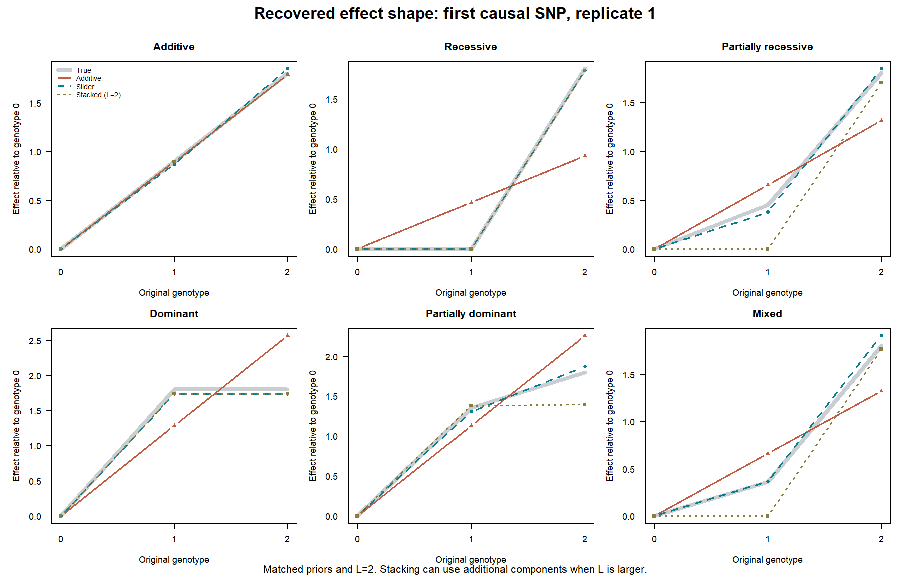

# Implementation and validation: susieSlide 0.1.0

Run on 18 September 2026 with R 4.6.1 on Windows 11. The engine is the local
susieR 0.16.6 checkout at `8e56a8e038e989856d106d9ca5175cc664fea9d2`.

The extension fits partial inheritance effects using one single-effect
component per causal SNP. In these examples this improves prediction over
additive-only SuSiE. Stacking can recover the same partial effects when given
enough components. The plug-in slider also overfits the null more often, so
these results do **not** establish calibrated genome-wide fine-mapping.

## What is implemented

The callable package is `susieSlide::susie`. It lives in the `susieSlide/`
subdirectory of the `susie_slide` branch. The parent susieR package retains
its name and behavior. The extension registers methods for a new data class
with its IBSS engine.

For each component l and candidate SNP j:

```
h_j = I(x_j == 1)
z_j(delta_lj) = [(x_j - mean(x_j)) + delta_lj*(h_j - mean(h_j))] / sd(x_j)
beta_l | selected SNP j ~ N(0, V_l)
-1 <= delta_lj <= 1
```

Both basis terms use the original additive genotype SD, fixed across delta.
Omit centering with `intercept=FALSE`, or use divisor one with
`standardize=FALSE`. Delta is already in the original genotype coordinates;
it requires no rescaling on output. The prior remains Gaussian, in the same
coefficient units as SuSiE. Under standardization its raw-scale variance is
`V_l / sd(x_j)^2`.

For partial residual r, let `s(delta)=z(delta)'z(delta)` and
`t(delta)=z(delta)'r`. The conditional log-BF and coefficient moments are

```
logBF(delta) = 0.5 * [V*t(delta)^2 / {sigma2*(sigma2 + V*s(delta))}
                     - log(1 + V*s(delta)/sigma2)]
v(delta) = V / (1 + V*s(delta)/sigma2)
m(delta) = v(delta)*t(delta)/sigma2
E(beta^2 | r, j, delta) = v(delta) + m(delta)^2
```

Beta is integrated analytically. A compiled solver maximizes this evidence
over delta, considering the endpoints and all stationary points of the cubic
derivative numerator. The SNP probabilities normalize these fitted scores
with the SNP prior weights. These are **plug-in evidence scores**, not Bayes
factors integrating over a delta prior.

The residual, fitted value, expected squared residual, residual variance,
prior-variance, KL, and conditional ELBO calculations include the slider.
Prior variances can be fixed, optimized, updated by EM, or subjected to the
upstream simple zero-versus-initial-variance check. The EM path refreshes the
conditional posterior at the new prior variance.

`fit$delta` is L-by-p and aligns with `fit$alpha`; `fit$delta_cs` gives the
slider for every SNP in every reported credible set. Purity uses each
component's transformed genotypes. Predictions use both additive and
heterozygote coefficients. If any of the three genotype counts is below
`min_obs=5`, delta is fixed to zero for that SNP in all components, including
when a nonzero fixed delta was supplied.

## Implementation checks

`R CMD check --no-manual` completed with **Status: OK**: no errors, warnings,
or notes. The test suite passed **379 assertions**, with no failures, warnings,
or skips. The complete check and test logs are saved beside this report.

Tests compare evidence and coefficient moments to an independent Gaussian
covariance calculation; compare delta optimization to a dense grid plus local
refinement; and verify that `delta=0` reproduces this upstream engine's
posterior, evidence, variance estimates, fitted values, PIPs, objective, and
credible sets. Other checks cover independently calculated predictions,
expected residuals, KL and ELBO, genotype-count boundaries, absent classes,
constant columns, allele reversal, sparse matrices, cached versus chunked
heterozygotes, null columns, variance EM, warm starts, input rejection, and
non-singleton transformed-genotype purity.

## Controlled comparison with matched priors

Ten independent repetitions per scenario used 1,000 training observations,
2,000 test observations, 80 hard-call SNPs, four correlated haplotype blocks
(adjacent-allele retention 0.8), and two causal variants. MAFs were 0.25-0.4.
The two coefficients were 0.9 and -0.8, and noise SD was 0.6.

The main experiment uses L=2, known residual variance 0.36, and fixed effect
prior variance 0.5 on the additive-SD scale. The stacked columns are
`[X, 2*I(X>=1), 2*I(X==2)]`, divided by the original additive SD; this matches
the prior for the three slider endpoints. Uniform coding weights give each
SNP total prior probability 1/p.

`Stack_EM` is an additional comparator with variational EM updates of the
three coding weights. It is distinct from the EM option in the user's
workhorse, which estimates coefficient-prior variances.

Average test MSE **against the noiseless generating mean** (smaller is better):

| Generating effect | Additive | Slider | Stacked, equal | Stacked, coding-weight EM |
|---|---:|---:|---:|---:|
| Additive | 0.000875 | 0.001393 | 0.000875 | 0.000875 |
| Recessive | 0.225293 | 0.001185 | 0.000854 | 0.000854 |
| Partially recessive | 0.057467 | 0.002137 | 0.063632 | 0.065332 |
| Dominant | 0.231221 | 0.001701 | 0.001152 | 0.001152 |
| Partially dominant | 0.060324 | 0.001548 | 0.024349 | 0.024825 |
| Mixed partial effects | 0.083667 | 0.002303 | 0.038876 | 0.039091 |

All main and sensitivity fits, including coding-weight EM, converged.
All methods recovered both causal SNPs in these strong-signal examples,
with causal PIPs essentially one and singleton candidate sets. Thus these
simulations demonstrate effect-shape recovery, **not improved variant
identification or calibrated credible-set coverage**. The CSV coverage metric
is membership in any component's 95% SNP-level candidate set without a
purity filter; it is not a frequentist coverage study.

Mean absolute delta errors across the 20 causal SNPs per scenario were
0.033 (additive), 0.018 (recessive), 0.042 (partially recessive), 0.049
(dominant), 0.040 (partially dominant), and 0.057 (mixed).



### Effect of the component budget

A partial slider can be represented by a combination of stacked columns:
`x + delta*h = (1-|delta|)*x + |delta|*endpoint(x)`, where the endpoint
is `2*I(x>=1)` for positive delta and `2*I(x==2)` for negative delta.
Stacking may therefore need two components for one biological SNP.

Allowing L=4 and estimating prior variances, while keeping noise variance
known, gave the following **single-replicate sensitivity** results:

| Effect | Slider | Stacked, equal | Stacked, coding-weight EM |
|---|---:|---:|---:|
| Partially recessive | 0.003866 | 0.003918 | 0.003915 |
| Partially dominant | 0.001069 | 0.000927 | 0.000927 |
| Mixed | 0.000981 | 0.001139 | 0.001113 |

The large advantage seen at L=2 mostly disappears with extra components.
This is an advantage in representing partial effects compactly, not universal
statistical superiority over stacking. Pure additive/recessive/dominant
effects also sometimes favor the correctly specified discrete coding.

## Comparison using the existing susie_mix workhorse settings

The source inspected was
`C:/Document/Serieux/Travail/Data_analysis_and_papers/susie_mix/script/scan_tissue_attempt/workhorse.R`
and `workhorse_utils.R`. The comparison uses their core ordinary-mix setup:
raw `[X,I(X>=1),I(X==2)]`, `standardize=FALSE`, L=10,
`estimate_prior_method="EM"`, learned noise variance, and uniform predictor
weights. No columns failed the workhorse's count filter in these examples.
This reproduces the fitting setup on synthetic Gaussian data, not the full
GTEx preprocessing pipeline or its optional weighted-mixture variant.

The six data sets are the first repetitions above. With tolerance 1e-6 and
maximum 1,000 iterations:

| Effect | Additive EM MSE | Slider EM MSE | susie_mix EM MSE | Converged A / slider / mix |
|---|---:|---:|---:|---|
| Additive | 0.001711 | 0.002209 | 0.001713 | no / yes / no |
| Recessive | 0.226997 | 0.001604 | 0.001003 | yes / yes / yes |
| Partially recessive | 0.059623 | 0.004032 | 0.003813 | no / yes / no |
| Dominant | 0.214198 | 0.002335 | 0.001270 | no / yes / yes |
| Partially dominant | 0.060947 | 0.001149 | 0.000927 | yes / yes / no |
| Mixed | 0.086795 | 0.001025 | 0.001161 | no / yes / no |

Slider fits converged in 26-84 iterations. Four of six additive and four of
six stacked fits did not reach the stricter tolerance within 1,000 iterations;
their rows report the last iterate, and all warnings are retained in the CSV.
There were no observed ELBO decreases in any of these 18 fits. Do not read
the large wall-time differences here as a per-iteration speed comparison:
the iteration counts and stopping outcomes differ substantially.

## Null diagnostic: a material limitation

Thirty independent global-null simulations used n=300, p=60, MAF=0.3, L=3,
learned prior/noise variances, tolerance 1e-6, and maximum 1,000 iterations.
All 90 fits converged. This diagnostic uses each method's usual column
standardization and uniform SNP/coding weights; its priors differ from the
controlled endpoint-matched experiment.

| Method | Mean maximum SNP PIP | Mean sum of SNP PIPs | Replicates with any SNP PIP > 0.5 | Mean active components |
|---|---:|---:|---:|---:|
| Additive | 0.102 | 1.309 | 1/30 | 1.33 |
| Slider | 0.270 | 2.932 | 4/30 | 3.00 |
| Stacked | 0.105 | 1.506 | 2/30 | 1.53 |

The slider retained all three nonzero-variance components in every null
replicate. Optimizing a separate delta for each candidate SNP raises the
evidence without a corresponding integration penalty. The results provide
direct evidence of extra null fitting, although 30 replicates are too few
to estimate genome-wide error rates. Both additive and slider returned a
purity-filtered CS in one null replicate; stacking returned none.

This implementation preserves the requested plug-in model. It does not
silently introduce a prior or penalty on delta. A shrinkage or integrated
delta model and broader calibration experiments are appropriate next steps
before treating its PIPs as genome-wide probabilities. The rare-count
fallback alone does not correct this issue.

## Timing and scale

An actual compiled pass over **1,000,000 distinct SNP sufficient-statistic
vectors** took 1.61, 1.63, and 1.61 seconds. It returned delta, log-BF, and
Gaussian moments at fixed variances. Of these SNPs, 78,928 triggered the
count fallback. Outputs were finite, bounded, and identical across runs.
These times exclude genotype products, data loading, prior-variance searches,
and all other SuSiE components and iterations.

End-to-end fits below include input checking, genotype preparation and IBSS,
but exclude genotype generation and construction of the stacked input.
Each size has one data set, one warm-up and three timed repetitions; values
are median seconds. These runs were repeated after compilation/checks had
finished. L=2 and both variances are fixed; coverage calculation is disabled.

| Individuals | SNPs | Additive | Slider | Stacked, equal |
|---:|---:|---:|---:|---:|
| 500 | 1,000 | 0.03 | 0.07 | 0.12 |
| 500 | 10,000 | 0.38 | 1.44 | 1.33 |

At 10,000 SNPs the slider used four IBSS iterations, stacking four, and
additive three. The slider is about 3.8 times the additive wall time here and
similar to stacking. Timings are machine- and problem-specific. Optimizing
the prior variance evaluates the slider repeatedly and can be substantially
more expensive than these fixed-variance fits; EM has a different iteration
cost and convergence behavior.

Geometry is cached, heterozygotes can be cached or reconstructed in bounded
blocks, and there is no dense p-by-p LD matrix. Nevertheless, the interface
uses an in-memory genotype matrix and L-by-p posterior arrays. A full fit
with millions of SNPs, packed-genotype streaming, peak-memory profiling and
genome-scale calibration have **not** been validated by this benchmark.

## Reproduction and files

From the `susieSlide` source directory, with this package and the compatible
local susieR installed:

```sh
Rscript inst/examples/compare_models.R
Rscript inst/examples/validation_diagnostics.R
Rscript inst/examples/plot_results.R
Rscript inst/examples/benchmark_fit.R
```

Scripts fix their random seeds. `SLIDE_COMPARISON_OUT` changes the output
directory and `SLIDE_COMPARISON_REPS` changes the main repetition count.
The source checkout contains raw per-fit CSVs, saved first-replicate fits,
session information and plots. They are excluded from the installed package.
The scripts themselves are installed under `system.file("examples",
package="susieSlide")`.

Initial scope: individual-level complete hard-call genotypes, Gaussian effect
priors and Gaussian residuals. RSS, missing/dosage genotypes, covariate input,
NIG, infinitesimal effects, refinement and greedy-L expansion are explicitly
unsupported. See the package README and help pages for API details.
